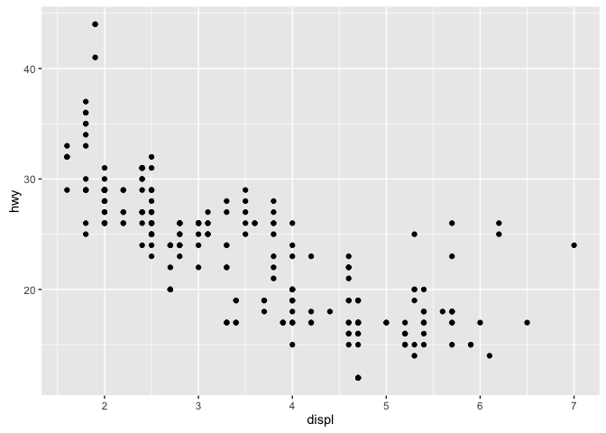

Inner Aesthetic Mappings
================
Charles Chu
May 25, 2016

Aesthetic mappings occur in two general ways:

1.  Inside the `aes()` function: Map and build a legend
2.  Outside the `aes()` function: Manually set aesthetics.

This post cover the first variant, which I call "Inner Aesthetic Mappings."

Using `ggplot2`, we can build a plot by adding successive layers.

A basic plot in `ggplot2` has two layers, the data layer and the geometric layer. The geometric layer is a "geom function" that takes an aesthetic mapping.

``` r
#import library
library(ggplot2)

#create base plot with inluded mpg dataset
ggplot(data = mpg) +
  geom_point(mapping = aes(x = displ, y = hwy))
```



Inner Aesthetic Mappings
------------------------

It would be nice to see what kind of car each of these points corresponds to. We can use aesthetic mapping inside the `aes()` function to give each class of car a different color.

``` r
par(mfrow=c(2,2))
#color aesthetic mapping
p1 <- ggplot(data = mpg) +
  geom_point(mapping = aes(x = displ, y = hwy, color = class)) 

#size aesthetic mapping
p2 <-ggplot(data = mpg) +
  geom_point(mapping = aes(x = displ, y = hwy, size = class)) 

#transparency aesthetic mapping
p3 <- ggplot(data = mpg) +
  geom_point(mapping = aes(x = displ, y = hwy, alpha = class)) 

#point shape aesthetic mapping
p4 <- ggplot(data = mpg) +
  geom_point(mapping = aes(x = displ, y = hwy, shape = class)) 
```

``` r
library(grid)
library(gridExtra)
grid.arrange(p1, p2, p3, p4, ncol=2, top="Aesthetic Mappings")
```


We can also include multiple aesthetic mappings at the same time.

``` r
#color aesthetic mapping
ggplot(data = mpg) +
  geom_point(mapping = aes(x = displ, y = hwy, 
                           color = class, alpha = class, shape = class))
```


Outer Aesthetic Mappings
------------------------

Here we apply aesthetics directly to the geom object and not the `aes()` function. Instead of producing a legend, we can change how the visuals look for the entire geom.

``` r
#color aesthetic mapping
p1 <- ggplot(data = mpg) +
  geom_point(mapping = aes(x = displ, y = hwy), color = 'green')

#size aesthetic mapping
p2 <-ggplot(data = mpg) +
  geom_point(mapping = aes(x = displ, y = hwy), size = 3) 

#transparency aesthetic mapping
p3 <- ggplot(data = mpg) +
  geom_point(mapping = aes(x = displ, y = hwy), alpha = 0.5)

#point shape aesthetic mapping
p4 <- ggplot(data = mpg) +
  geom_point(mapping = aes(x = displ, y = hwy), shape = 2)

library(grid)
library(gridExtra)
grid.arrange(p1, p2, p3, p4, ncol=2)
```


Multiple Geoms
--------------

The power of ggplot2 lies in its layers. We can also produce multiple geoms on top of one another.

``` r
ggplot(data = mpg) +
  geom_point(mapping = aes(x = displ, y = hwy)) +
  geom_smooth(mapping = aes(x = displ, y= hwy))
```


It is a lot of work to pass each geom the same aes mapping. We can instead pass our aes directly to ggplot for a global map.

``` r
ggplot(data = mpg, mapping = aes(x = displ, y = hwy)) +
  geom_point() +
  geom_smooth()
```


Same result, less hassle.
